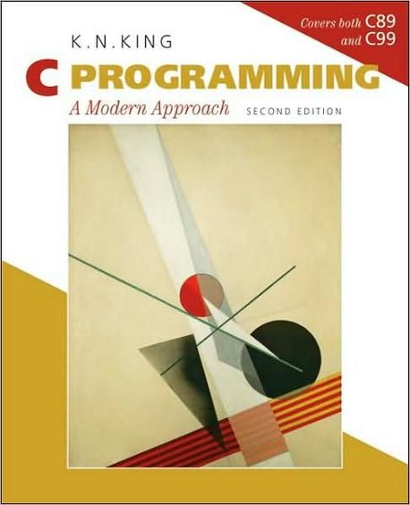

# K.N.KING C PROGRAMMING A MODERN APPROACH 2ND EDITION

## contents

### Basic Features of C

1. [Introducing C](1_Introducing_c/README.md)
2. [C Fundamentals](2_C_Fundamentals/README.md)
3. [Formatted Input/Output](3_Formatted_Input_Output/README.md)
4. Expressions
5. Selection Statements
6. Loops
7. Basic Types
8. Arrays
9. Functions
10. Program Organization

### Advanced Features of C

11. Pointers
12. Pointers and Arrays
13. Strings
14. The Preprocessor
15. Writing Large Programs
16. Structures, Unions, and Enumerations
17. Advanced Uses of Pointers
18. Declarations
19. Program Design
20. Low-Level Programming

### The Standard C Library

21. The Standard Library
22. Input/Output
23. Library Support for Numbers and Character Data
24. Error Handling
25. International Features
26. Miscellaneous Library Functions
27. Additional C99 Support for Mathematics

### Reference

- C Operators
- C99 versus C89
- C89 versus K&R C
- Standard Library Functions
- ASCII Character Set